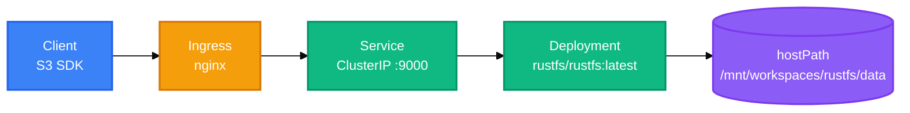

<h1 align="center">rustfs</h1>

<p align="center">
  <strong>Kubernetes deployment and runtime data for the RustFS S3-compatible object storage server.</strong>
  <br />
  <em>S3 · Kubernetes · Nginx Ingress · hostPath storage</em>
</p>

<p align="center">
  <a href="#quick-start"></a>
  <a href="LICENSE"></a>
</p>

<p align="center">
  
  
  
  
</p>

This workspace is the deployment module for **RustFS**, an S3-compatible object storage server. It ships Kubernetes manifests and generated runtime data only — the RustFS source, build scripts, and CI configuration live in the upstream project. This repo consumes the `rustfs/rustfs:latest` container image instead of compiling from source.

## Features

| Feature | Description |
|---|---|
| Single-manifest deployment | One YAML file defines Service, Deployment, and Ingress — apply and run |
| S3-compatible endpoint | S3 API served on port `9000`, reachable via `s3.localhost` and `*.s3.localhost` |
| Persistent storage | hostPath volume with `DirectoryOrCreate`, mounted as the bucket root `/data` |
| Secret-based credentials | `RUSTFS_ACCESS_KEY`/`RUSTFS_SECRET_KEY` injected from a Secret via `envFrom` |
| Large upload support | nginx Ingress annotation raises the proxy body-size limit to 500 MB |
| Multi-hostname routing | Service DNS (`rustfs.default.svc.cluster.local`) is registered as a server domain |

## Quick Start

Prerequisites: a Kubernetes cluster with the nginx Ingress controller installed, and `kubectl` configured for the target namespace. No Namespace, StorageClass, or PVC objects ship in these manifests.

### 1. Create the data directory

```bash
mkdir -p /mnt/workspaces/rustfs/data
```

Only needed before deploying if you must seed data first — otherwise Kubernetes creates the host directory empty (`DirectoryOrCreate`).

### 2. Apply the Secret

```bash
kubectl apply -f k8s/rustfs-secret.yaml
```

The Secret must exist before the Deployment references it, or the webhook rejects the apply with "referent not found".

### 3. Deploy the workload

```bash
kubectl apply -f k8s/rustfs-deployment.yaml
```

This creates the Service (port 9000 → targetPort 9000), the Deployment (one replica), and the nginx Ingress in one pass.

## Usage

### Verify the workload

```bash
kubectl get pods,svc,ingress
```

Pods reach `Running`, the Service gains one endpoint per pod matching selector `app=rustfs`, and the Ingress advertises both host rules.

### Check the health endpoint

```bash
kubectl port-forward svc/rustfs 9000 && curl http://localhost:9000/minio/health/live
```

Expect HTTP 200. No readiness or liveness probe is declared in the manifests.

### Confirm the runtime environment

```bash
kubectl exec deploy/rustfs -- env | grep -E '^(RUSTFS_ADDRESS|RUSTFS_SERVER_DOMAINS)='
```

Should print `RUSTFS_ADDRESS=0.0.0.0:9000` and `RUSTFS_SERVER_DOMAINS=s3.localhost,rustfs,rustfs.default.svc.cluster.local`.

## Architecture

One file holds three objects: a ClusterIP Service, a single-replica Deployment, and an nginx Ingress. The Ingress routes both host rules to the Service port 9000, which forwards to the container; the container writes to the node's hostPath volume.



## Configuration

### Environment variables

| Variable | Description | Default / Value |
|---|---|---|
| `TZ` | Container timezone | `Asia/Hong_Kong` |
| `RUSTFS_ADDRESS` | Listen address for the S3 API | `0.0.0.0:9000` |
| `RUSTFS_SERVER_DOMAINS` | Accepted server hostnames | `s3.localhost,rustfs,rustfs.default.svc.cluster.local` |
| `RUSTFS_ACCESS_KEY` | S3 access key | From `rustfs-secret` (via `envFrom`) |
| `RUSTFS_SECRET_KEY` | S3 secret key | From `rustfs-secret` (via `envFrom`) |

### Resource limits

| Resource | Request | Limit |
|---|---|---|
| Memory | 64 Mi | 256 Mi |
| CPU | 50 m | 500 m |

## Project Structure

```
rustfs/
├── k8s/                    # Kubernetes manifests
│   ├── rustfs-deployment.yaml  # Service + Deployment + Ingress (3 documents)
│   └── rustfs-secret.yaml      # Plaintext credentials — git-ignored
├── data/                   # Generated at runtime, mounted in place
│   ├── .rustfs.sys/        # RustFS metadata (buckets, config, IAM format JSON)
│   └── langfuse-events/    # Langfuse event buckets
├── AGENTS.md               # Workspace conventions for AI agents
└── LICENSE                 # MIT
```

## Tech Stack

### Infrastructure

| Technology | Purpose |
|---|---|
| Kubernetes | Workload orchestration |
| Docker | Container runtime (`rustfs/rustfs:latest` image) |
| Nginx | Ingress controller, TLS/HTTP proxy |
| RustFS | S3-compatible object storage server |

### Storage

| Technology | Purpose |
|---|---|
| hostPath volume | Node-local persistence, `DirectoryOrCreate` |

## Deployment

### Apply or update

```bash
kubectl apply -f k8s/
```

Updates the Deployment in place; the image uses `:latest` with `IfNotPresent` pull policy. Pin a digest for reproducible deploys across nodes.

### Storage notes

- The host path `/mnt/workspaces/rustfs/data` is the source of truth on the node; do not edit the repo `data/` directory while RustFS is running — the container consumes it in place.
- Back up from `<host>/mnt/workspaces/rustfs/data`, not this repo directory.
- Runtime leftovers appear under `data/.rustfs.sys/` after the workload stops. These are RustFS-managed metadata, not config to edit.
- No PVC or StorageClass is declared; a new node starts empty until seeded.
- The workload is not sharded — one replica, one hostPath mount, so the hosting node is authoritative for data and config.

## Contributing

1. Fork the repository
2. Create a feature branch (`git checkout -b feature/amazing`)
3. Commit your changes (`git commit -m 'feat: add amazing feature'`)
4. Push to the branch (`git push origin feature/amazing`)
5. Open a Pull Request

## License

[MIT](LICENSE)

<!-- BEAUTIFIED -->
